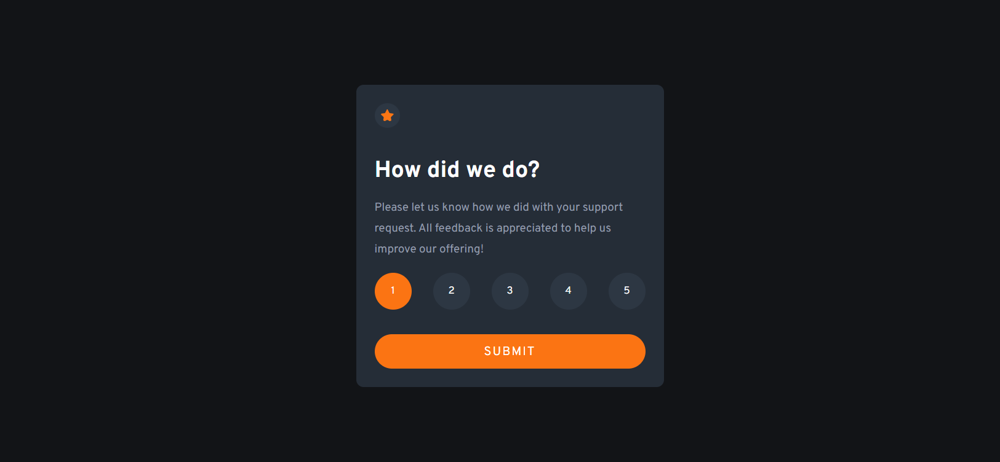

# Frontend Mentor - Interactive rating component solution

This is a solution to the [Interactive rating component challenge on Frontend Mentor](https://www.frontendmentor.io/challenges/interactive-rating-component-koxpeBUmI). Frontend Mentor challenges help you improve your coding skills by building realistic projects.

## Table of contents

- [Overview](#overview)
  - [The challenge](#the-challenge)
  - [Screenshot](#screenshot)
  - [Links](#links)
- [My process](#my-process)
  - [Built with](#built-with)
  - [What I learned](#what-i-learned)
  - [Continued development](#continued-development)
  - [Useful resources](#useful-resources)
- [Author](#author)

## Overview

### The challenge

Users should be able to:

- View the optimal layout for the app depending on their device's screen size
- See hover states for all interactive elements on the page
- Select and submit a number rating
- See the "Thank you" card state after submitting a rating

### Screenshot

### Links

- Live Site URL: [Click to open site](https://monesh-frontend-mentor-challenge2.netlify.app)

## My process

### Built with

- Semantic HTML5 markup
- CSS custom properties
- Flexbox
- CSS Grid
- Mobile-first workflow

### What I learned

In this frontend mentor challenge i created a interactive-rating-component-card, this challenge was really good and was helpful for me to revise properties like flexbox and some topics in javaScript.

### Continued development

In future projects I would like to to focus more on advance CSS properties like CSS Grid and much more and will try to solve those challenges to get hands-on experience on styling components.

### Useful resources

- [Example resource 1](https://developer.mozilla.org/en-US/docs/Learn/CSS/CSS_layout/Flexbox) - This helped me for revising flexbox concepts easily. I really liked this pattern and will use it going forward.

## Author

- Website - [Monesh Goyal](https://2201monesh.github.io/Monesh-Goyal/)
- Frontend Mentor - [@2201monesh](https://www.frontendmentor.io/profile/2201monesh)
- Twitter - [@GoyalMonesh](https://www.twitter.com/GoyalMonesh)
